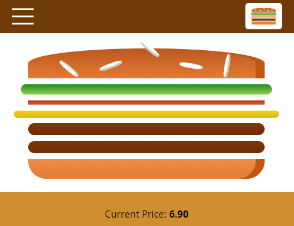

# AV Burgers Project

## Description
1 year ago I finished ReactJS training course on Udemy and now reviting it I came to conclusion that I as a burger lover I should finish the project.
Initially the project was based custom config build but I changed to my favorite ReactJS boilerplate - Create React App.
Project basically is website to order burgers with integration to Google Firebase.
#### [Demo](https://av-burgers.netlify.com/)

## TODO
 - re-write code in Typescript
 - redesign the ugly design )

## Technologies Used
- ReactJS
- Create React App

## Features
- authentication (sign up/sign in)
- Google Firebase integration
- see order history
- mobile/desktop responsive layout

## Setup
- `npm install` inside root folder

## How to contribute?
Contact me through mail `vilde.andris@gmail.com` with suggestions.
